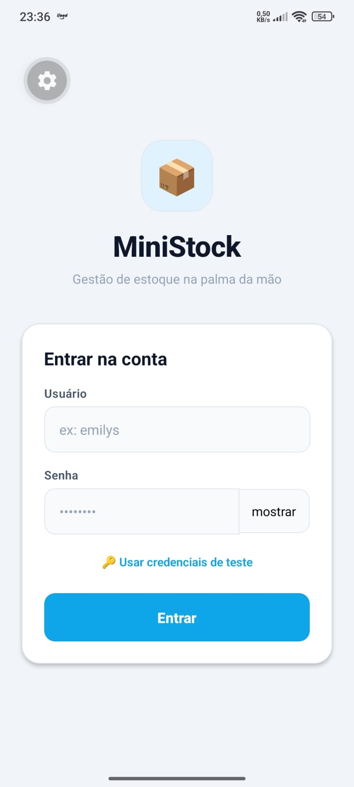
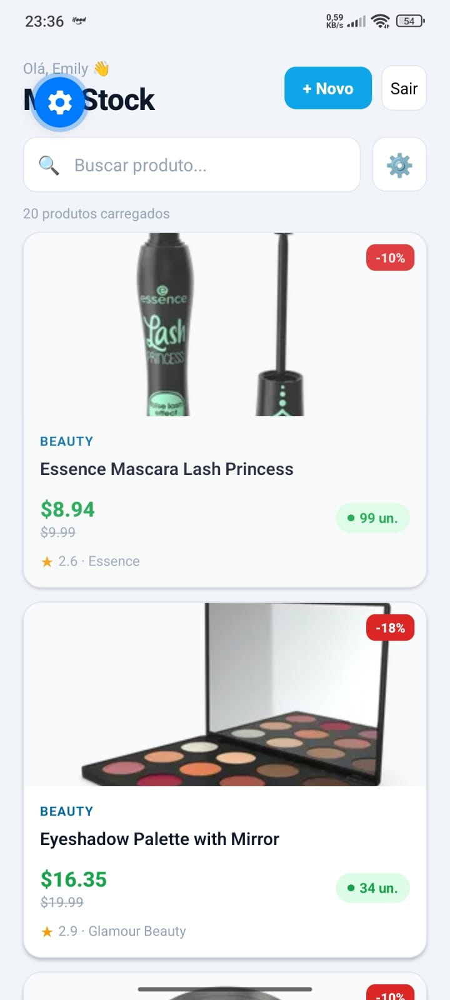
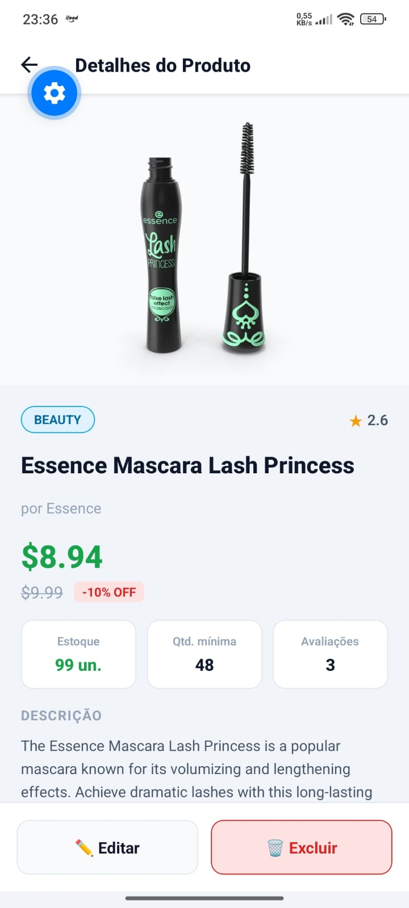
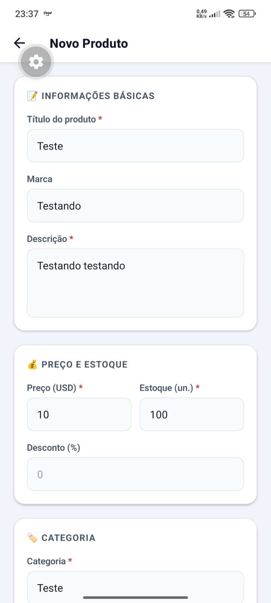

# MiniStock Mobile

App mobile de gestão de estoque construído com **React Native + Expo**, consumindo a API pública [DummyJSON](https://dummyjson.com) com **axios** de forma profissional.

> Projeto avaliativo — Matéria de Desenvolvimento Mobile

---

## Funcionalidades

- **Login** com autenticação JWT via DummyJSON (`/auth/login`)
- **Listagem de produtos** com FlatList, paginação infinita e pull-to-refresh
- **Busca por termo** com debounce e **filtro por categoria** via modal
- **Tela de detalhes** com galeria de imagens, avaliações e informações completas
- **Cadastro** de novos produtos com validação completa de formulário
- **Edição** de produtos existentes
- **Exclusão** com diálogo de confirmação (`Alert.alert`)
- **Logout** funcional limpando AsyncStorage
- **Tratamento de estados** em todas as telas: loading, erro e lista vazia
- **Persistência local do estado** após criar, editar ou excluir (API simulada)

---

## Stack

| Tecnologia | Uso |
|---|---|
| React Native + Expo | Framework mobile |
| axios | Todas as requisições HTTP |
| React Navigation (native-stack) | Navegação entre telas |
| AsyncStorage | Persistência do token JWT |
| DummyJSON | API pública de testes |

---

## Estrutura do Projeto

```
ministock/
├── App.js # Raiz: AuthProvider + ProductProvider + AppNavigator
├── src/
│ ├── services/
│ │ ├── api.js # ★ Instância axios com interceptors
│ │ ├── authService.js # Login, logout, AsyncStorage
│ │ └── productService.js # CRUD completo de produtos
│ ├── context/
│ │ ├── AuthContext.js # Estado global de autenticação + listener de 401
│ │ └── ProductContext.js # Estado local dos produtos + operações de escrita
│ ├── navigation/
│ │ └── AppNavigator.js # Rotas autenticadas e públicas
│ ├── screens/
│ │ ├── LoginScreen.js
│ │ ├── ProductListScreen.js
│ │ ├── ProductDetailScreen.js
│ │ └── ProductFormScreen.js
│ ├── components/
│ │ ├── ProductCard.js
│ │ ├── LoadingSpinner.js
│ │ ├── ErrorMessage.js
│ │ └── EmptyState.js
```

---

## Instalação e execução

### Pré-requisitos

- Node.js 18+
- npm ou yarn
- Expo Go instalado no celular **ou** emulador Android/iOS

### Passos

```bash
# 1. Clonar o repositório
git clone https://github.com/cotonho/ministock.git
cd ministock

# 2. Instalar dependências
npm install

# 3. Iniciar o servidor de desenvolvimento
npx expo start
```

Escaneie o QR code com o aplicativo **Expo Go** (Android) ou a câmera (iOS).

---

## Credenciais de Teste

```
Usuário: emilys
Senha:   emilyspass
```

Ou toque em **"Usar credenciais de teste"** na tela de login.

---

## Arquitetura do Axios

### `src/services/api.js` — Instância única

```js
const api = axios.create({
  baseURL: 'https://dummyjson.com',
  timeout: 10000,
});
```

### Interceptor de Request
Injeta o token JWT automaticamente em **todas** as requisições autenticadas, lendo-o do AsyncStorage.

### Interceptor de Response
Trata globalmente:
- `ECONNABORTED` → timeout
- Sem resposta → erro de rede
- `401` → sessão expirada
- `404` → recurso não encontrado
- `5xx` → erro de servidor

### Regras obrigatórias seguidas
- Instância única com `baseURL` e `timeout`
- Interceptors de request e response
- `params` do axios (nunca concatenação de query string)
- `async/await` com `try/catch/finally` em todos os serviços
- Zero chamadas axios em componentes de tela

---

## Endpoints utilizados

| Método | Endpoint | Uso |
|---|---|---|
| POST | `/auth/login` | Login |
| GET | `/products` | Listar produtos (paginado) |
| GET | `/products/search` | Buscar por termo |
| GET | '/products/category-list' | Listar categorias |
| GET | `/products/category/:slug` | Filtrar por categoria |
| GET | `/products/:id` | Detalhes do produto |
| POST | `/products/add` | Criar produto |
| PUT | `/products/:id` | Editar produto |
| DELETE | `/products/:id` | Excluir produto |

---

## Capturas de Tela

| Login | Lista de Produtos | Detalhes | Cadastro / Edição |
|---|---|---|---|
|  |  |  |  |

---

## Vídeo Demonstrativo

> [Assista no YouTube/Loom](https://youtube.com/shorts/bDkQQOc6Ji0?si=JdEBBBFWunHssF2b)

---

## Documentação

- [axios](https://axios-http.com/docs/intro)
- [DummyJSON](https://dummyjson.com/docs)
- [React Native](https://reactnative.dev/docs/getting-started)
- [Expo](https://docs.expo.dev)
- [React Navigation](https://reactnavigation.org/docs/getting-started)
- [AsyncStorage](https://react-native-async-storage.github.io/async-storage/)
